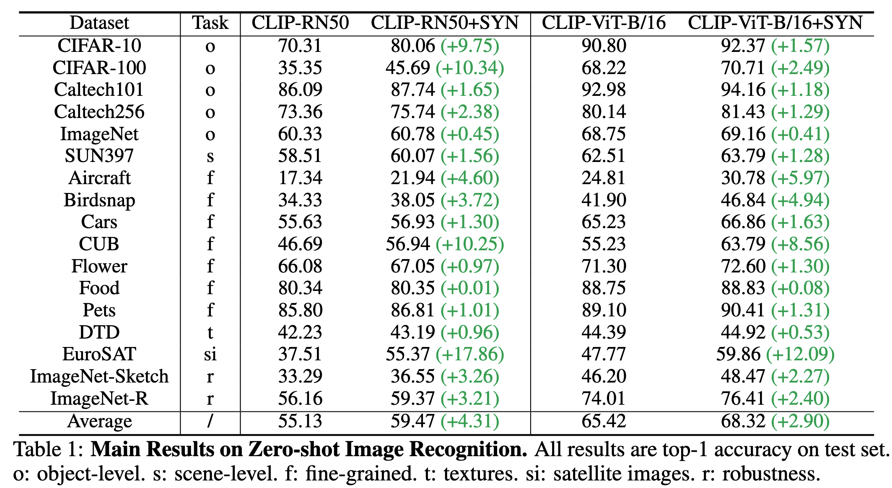
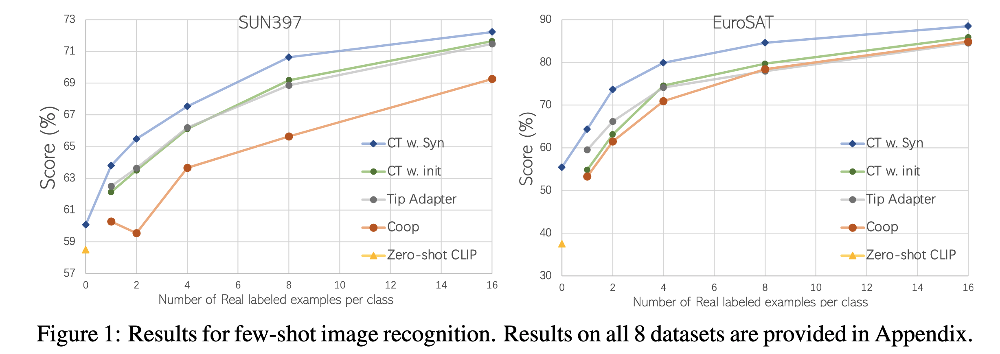
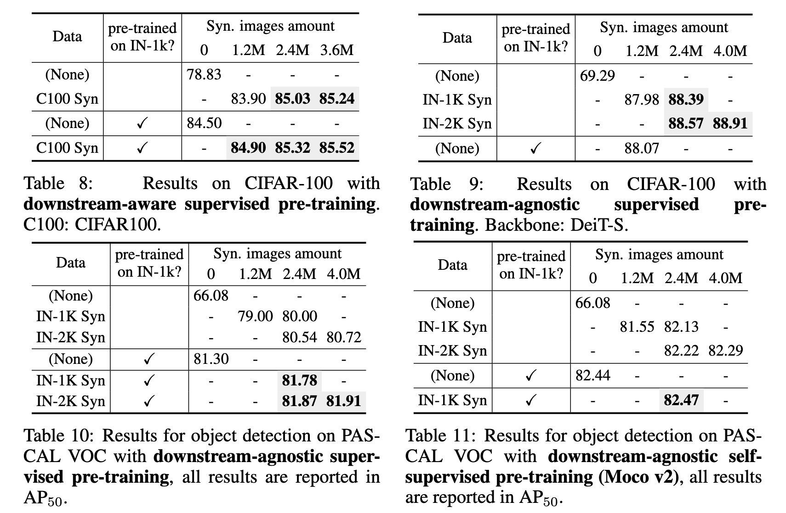

# Is synthetic data from generative models ready for image recognition?

<p align="center">
    <a href="https://arxiv.org/abs/2210.07574"></a>
  <a href="https://github.com/CVMI-Lab/SlotCon/blob/master/LICENSE"></a>
</p>
<p align="center">
	Is synthetic data from generative models ready for image recognition? (ICLR 2023, Spotlight)<br>
  By
  <a href="https://scholar.google.com.hk/citations?user=P7IL0hkAAAAJ&hl=en">Ruifei He</a>, 
  <a href="https://kevin-ssy.github.io/"> Shuyang Sun</a>, 
  <a href="https://scholar.google.com.sg/citations?user=JX8kSoEAAAAJ&hl=zh-CN&oi=sra">Xin Yu</a>, 
  <a href="https://scholar.google.com.sg/citations?user=KJU5YRYAAAAJ&hl=en">Chuhui Xue</a>, 
   <a href="https://www.linkedin.com/in/wenqing-zhang-361570202/?originalSubdomain=sg">Wenqing Zhang</a>,
   <a href="https://www.robots.ox.ac.uk/~phst/">Philip Torr</a>,
   <a href="https://songbai.site/">Song Bai</a>,
  <a href="https://xjqi.github.io/">Xiaojuan Qi</a>.
</p>


## Abstract

Recent text-to-image generation models have shown promising results in generating high-fidelity photo-realistic images. Though the results are astonishing to human eyes, how applicable these generated images are for recognition tasks remains under-explored. In this work, we extensively study whether and how synthetic images generated from state-of-the-art text-to-image generation models can be used for image recognition tasks, and focus on two perspectives: synthetic data for improving classification models in data-scarce settings ({\ie} zero-shot and few-shot), and synthetic data for large-scale model pre-training for transfer learning. We showcase the powerfulness and shortcomings of synthetic data from existing generative models, and propose strategies for better applying synthetic data for recognition tasks.








## Getting started

1.  Clone our repo: `git clone https://github.com/CVMI-Lab/SyntheticData.git`

2.  Install dependencies:
    ```sh
    conda create -n SyntheticData python=3.7
    conda activate SyntheticData
    pip install -r requirements.txt
    ```


## Zero-shot settings

### Synthetic data generation

#### Language Enhancement

We generate sentences from label names of a specific dataset and save the generated sentences offline.

Input the targeted label space in variable `labels` in file `src/LE.py` and run it like:

```sh
python3.7 src/LE.py 200 /path/to/save/dataset.pkl
```

where 200 is the number of sentence for each label, and the latter is the save path for the generated sentences.

#### Text-to-Image generation

We use  [GLIDE](https://github.com/openai/glide-text2im) for text-to-image generation, and follow the [official instructions](https://github.com/openai/glide-text2im/blob/main/notebooks/text2im.ipynb) for the generation process. 

We use text generated from language enhancement as prompts for the text-to-image generation.

We provide a multi-gpu generation code example in `src/glide/glide_zsl.py` and run it like:

```sh
sh glide/gen_zsl.sh /path/to/save/dataset.pkl /path/to/save/dataset
```

#### CLIP Filter

We use CLIP to help filter out unreliable images:

```sh
# under dir: classifier-tuning
python3.7 src/select_glide_ims_by_clip.py /path/to/synthetic/dataset 10 # 10 is the number of class for a given task
```

### Synthetic data for ZSL: Classifier-Tuning with CLIP

We revise from the [Wise-ft](https://github.com/mlfoundations/wise-ft) codebase. Here, we provide a example for the Eurosat dataset.

"model" could choose "RN50"/"ViT-B/16".

Note that you should download the validation/test data for each dataset and revise the path in `src/classifier-tuning/src/dataset/transfer_datasets.py`.

```sh
python3.7 src/ct_zsl.py   \
      --freeze-encoder \
      --sl=0.5 \
      --sl_T=2 \
      --train-dataset=Eurosat  \
      --save=/path/to/save/results \
      --epochs=30  \
      --lr=2e-3  \
      --wd=0.1 \
      --batch-size=512  \
      --warmup_length=0 \
      --cache-dir=cache  \
      --model=RN50  \
      --eval-datasets=Eurosat \
      --template=eurosat_template  \
      --results-db=results.jsonl  \
      --data-location=/path/to/synthetic/data | tee results/${exp_name}/train-$now.log
```


## Few-shot settings

### Synthetic data generation-RG

We provide the code for our proposed Real Guidance strategy. We would first obtain a set of few-shot images for a given task. You may need to revise the function `get_few_shot_images_path_prompt_pairs()` that returns a list of (im_path, prompt) in file `src/glide/glide_fsl.py`.

Also, you should set the variable `refer_img_iters` to 15, 20, 35, 40, and 50 for shot 16, 8, 4, 2, and 1, respectively, and make the result of `batch_size * batch_size_time * shot =800`. 

 We provide a multi-gpu generation code example in `src/glide/glide_fsl.py` and run it like:

```sh
sh glide/gen_fsl.sh /path/to/few-shot/images /path/to/save/dataset
```

### Synthetic data for FSL: Classifier-Tuning with CLIP

Again, we revise from the [Wise-ft](https://github.com/mlfoundations/wise-ft) codebase. Following is a example: 

```sh
python3.7 src/ct_fsl.py   \
      --freeze-encoder \
      --sl=0.5 \
      --sl_T=2 \
      --train-dataset=Eurosat  \
      --save=/path/to/save/results \
      --epochs=30  \
      --lr=1e-3  \
      --wd=0.1 \
      --batch-size-real=32  \
      --batch-size-syn=512  \
      --loss-weight=1.0 \
      --loss-weight-real=1.0 \
      --warmup_length=0 \
      --cache-dir=cache  \
      --model=RN50  \
      --eval-datasets=Eurosat \
      --template=eurosat_template  \
      --results-db=results.jsonl  \
      --data-location=/path/to/synthetic/data \
      --data-location-real=/path/to/few-shot/data | tee results/${exp_name}/train-$now.log

```


## Pre-training settings

### Synthetic data generation

We adopt language enhancement strategy only for pre-training setting. Please modify the files (`src/LE.py`, `src/glide/glide_zsl.py`) in zero-shot settings for generating synthetic pre-training data.

### Pre-training with synthetic data

We recommend using [timm](https://github.com/rwightman/pytorch-image-models) codebase for its wonderful implementation for pre-training. For concrete hyper-parameters, please refer to Sec. C.5.3 in our Appendix. 


## Citing this work

If you find this repo useful for your research, please consider citing our paper:

```
@article{he2022synthetic,
  title={Is synthetic data from generative models ready for image recognition?},
  author={He, Ruifei and Sun, Shuyang and Yu, Xin and Xue, Chuhui and Zhang, Wenqing and Torr, Philip and Bai, Song and Qi, Xiaojuan},
  journal={arXiv preprint arXiv:2210.07574},
  year={2022}
}
```


## Acknowledgement

We thank the open source code from [GLIDE](https://github.com/openai/glide-text2im), [CLIP](https://github.com/openai/CLIP), [keytotext](https://github.com/gagan3012/keytotext), [Wise-ft](https://github.com/mlfoundations/wise-ft), [timm](https://github.com/rwightman/pytorch-image-models), [Detectron2](https://github.com/facebookresearch/Detectron2), [DeiT](https://github.com/facebookresearch/deit), [MoCo](https://github.com/facebookresearch/moco). 

